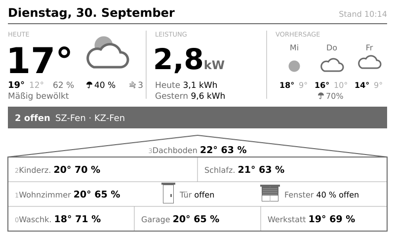
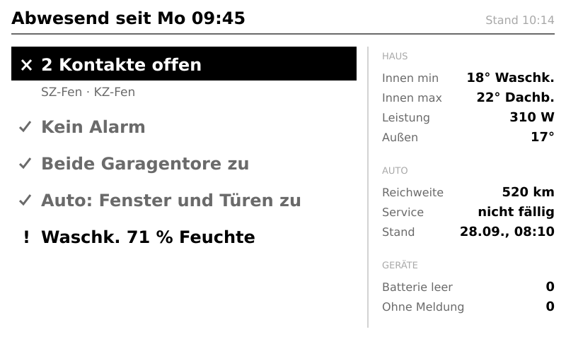
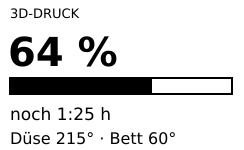
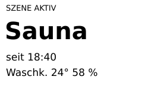
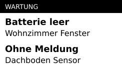
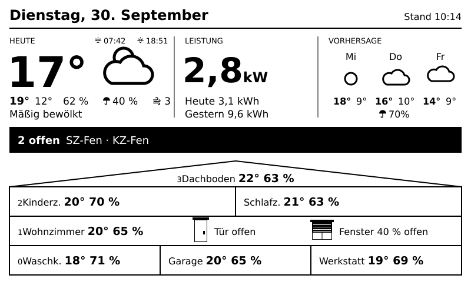

# E-paper home dashboard 7.5″

ESPHome firmware for a Waveshare 7.5″ e-paper display (V2, 800 × 480) on the Waveshare ESP32 driver board.
The display wakes up from deep sleep on a schedule, receives one JSON document from Node-RED via MQTT
(`esphome/display`) and redraws only when something relevant changed, using 4 gray levels.



*Layout A, the daily overview: date, today's weather, power and energy, forecast, a hint bar for open
windows and doors, and a cross-section of the house with temperature and humidity per room and the
living room shutters. Design mockup with example values.*



*Layout B, shown while away or on holiday: a checklist (open contacts, alarm, garage doors, car,
humidity) and a summary of house, car and devices. Problems stay black, everything that is fine
recedes into gray. Design mockup with example values.*

While a 3D print is running or a scene is active, a context tile replaces power and energy in the
middle column, so the forecast stays visible. Battery devices that need attention replace the forecast:

  

- `HomeDashboard1.yaml`: main file with the settings (substitutions)
- `packages/`: board, display driver, network/MQTT, fonts, battery, wake and sleep cycle
- `display/`: data model, JSON parser, rendering (layout A daily overview, layout B away), change detection
- `components/epaper_gray/`: driver extension for 4 gray levels (GPL-3.0, see `NOTICE.md` there)
- `test/`: PC tests for rendering and change detection, using a mock of the ESPHome display API

## Display variants

`HomeDashboard1.yaml` selects the display package:

- `packages/display_gray.yaml` (default): 4 gray levels. Values in black, labels, units and lines in
  gray. Uses `components/epaper_gray/` (GPL-3.0). Setting the substitution `grayscale: "false"`
  draws black and white with the same driver.
- `packages/display_bw.yaml`: black and white with ESPHome's standard `waveshare_epaper` driver.
  Gray elements are drawn in black; no GPL-licensed file from this project is used.



## Low-power modification

On the Waveshare driver board (Rev 3) the display supply (Q31, Q32, regulator RT9193) is switched on
permanently through R19. The board already has a footprint to let the ESP32 switch it instead, which
lowered the deep-sleep current from 511 µA to 216 µA (measured at 3.25 V on the 3.3 V pin, PWR LED
already disabled):

1. Remove R19 (10 kΩ, on the back next to Q31/Q32).
2. Solder it onto the empty pads of R35 directly below. R35 is the base resistor between IO4 and Q32;
   do not bridge it with solder, the GPIO would then drive the transistor base without current limit.

The firmware drives IO4 (`epd_power` in `packages/board_waveshare.yaml`): on at boot before the display
is set up, off right before deep sleep. On an unmodified board IO4 is not connected, so the same
firmware runs on both. Flash it before doing the modification, otherwise the display gets no power.
Removing the PWR LED (or cutting its trace) saves another 0.5–1 mA.

Estimated battery life with the 10-minute wake interval and the night pause (awake idle with WiFi
25 mA measured, refresh 5 s at about 33 mA on roughly every second wake-up, 90 % usable capacity):

| | before (511 µA) | after (216 µA) |
|---|---|---|
| Consumption per day | ~18 mAh | ~11 mAh |
| LiFePO4 700 mAh | ~5 weeks | ~8 weeks |
| LiFePO4 1800 mAh | ~3 months | ~5 months |
| LiFePO4 2000 mAh | ~3.5 months | ~5.5 months |

## Battery monitoring

`packages/battery.yaml` measures the supply voltage on GPIO33, which is wired directly to the 3.3 V pin
fed by a LiFePO4 cell. The measurement runs once per wake-up before WiFi starts:

- The voltage is published retained on `esphome/<name>/battery`; in maintenance mode it is measured again
  before every redraw.
- Below 3.05 V the display shows "Akku schwach" in the hint bar (off again above 3.10 V).
- Below 2.90 V it draws "Akku leer – bitte laden" once and then sleeps for 6 hours without WiFi, to
  protect the cell from deep discharge; it checks again after each period.

GPIO33 needs a 1:2 voltage divider (for example 2 × 470 kΩ plus 100 nF to GND at the pin): wired
directly to the supply it runs from, the ADC saturates at ~3.13 and reads ~0.4 V too high below ~2.9 V.
Until the divider is fitted, `HomeDashboard1.yaml` overrides the thresholds with values measured on this
board (3.12 ≈ 2.86 V, 3.07 ≈ 2.75 V). Readings below 2.5 V (pin not connected, powered via USB) are
ignored. Remove the package if GPIO33 is not wired.

## Language

Code, comments and logs are in English. The texts shown on the display are German on purpose
(weekdays, labels such as "Heute", "Vorhersage", "Stand"); they live in `display/render.h`.
Room abbreviations (`DB`, `KZ`, `WZ`, …) follow the German room names and are explained in
`display/model.h`.

## Setup

1. Create `secrets.yaml` with `wifi_ssid`, `wifi_password` and `home_dashboard_ota_password`.
2. Fonts: `Fonts/Verdana.ttf` and `Fonts/VerdanaBold.ttf` are not included (Microsoft, redistribution
   not permitted). Copy them from your own Windows or macOS installation into `Fonts/`.
   `Fonts/materialdesignicons.ttf` is from Pictogrammers (Material Design Icons).
3. `esphome run HomeDashboard1.yaml`

The running firmware build (ESPHome version and build time) is published retained on
`esphome/<name>/firmware` after every cold boot (power-on, reset, update), not after deep sleep. Check it after an OTA update: if a new image hangs during boot, the task
watchdog resets the board and the bootloader silently falls back to the previous image.

After the first flash the device runs in deep sleep. For OTA updates, enable maintenance mode in
Node-RED (retained `esphome/maintenance` = `on`); the device then stays awake on its next wake-up.

## Data interface

The display reads a single JSON document from the MQTT topic `esphome/display`. Publish it with
`retain`, so the display finds it immediately after waking up, and republish whenever a value changes.
Any source can produce it (Node-RED, Home Assistant, a script); the parser is `display/parse.h`.

Every field except `v` is optional. A missing field or `null` means "unknown": values show as `–`,
optional parts (car, print tile, scene tile) are hidden. Unknown fields are ignored.

```json
{
  "v": 1,
  "power": 180,
  "energy": { "today": 1.7, "yesterday": 4.1 },
  "out": { "t": 14, "hi": 23, "lo": 14, "h": 72, "bft": 3, "gbft": 5, "pop": 60, "detail": "Klarer Himmel", "icon": 800 },
  "fc": [
    { "n": "Do", "i": 804, "hi": 21, "lo": 15, "gbft": 4, "pop": 20 },
    { "n": "Fr", "i": 500, "hi": 18, "lo": 11, "gbft": 7, "pop": 70 },
    { "n": "Sa", "i": 802, "hi": 17, "lo": 10, "gbft": 3, "pop": 0 }
  ],
  "rooms": { "db": [21, 64], "kz": [21, 68], "sz": [21, 64], "wz": [20, 63], "wk": [20, 68], "ga": [21, 62], "we": null },
  "contacts": { "open": 2, "names": ["SZ-Fen", "KZ-Fen"] },
  "attention": "",
  "mode": { "away": false, "holiday": false, "since": "" },
  "alarm": null,
  "scene": null,
  "devices": { "batt": [], "dead": [] },
  "car": null,
  "roller": { "fenster": 100, "tuer": 40 },
  "print": null
}
```

| Field | Type and unit | Meaning |
|---|---|---|
| `v` | integer | Format version, must be `1`; other versions are ignored |
| `power` | W | Current power consumption; shown in kW from 1000 W |
| `energy.today`, `energy.yesterday` | kWh | Energy used today and yesterday |
| `out.t` | °C | Outdoor temperature; whole degrees keep the large number narrow |
| `out.hi`, `out.lo` | °C, integer | Today's high and low |
| `out.h` | % | Outdoor humidity |
| `out.bft` | Beaufort 0–12 | Mean wind, shown as "Wind N" |
| `out.gbft` | Beaufort 0–12 | Gusts; from 7 the dry-weather icon turns windy (off again below 6) |
| `out.pop` | % 0–100 or null | Probability of precipitation for the rest of today (OpenWeatherMap `pop`, rounded to 10); shown from 30 % |
| `out.detail` | text | Weather description line |
| `out.icon` | OpenWeatherMap condition ID | Today's weather icon |
| `fc[]` | array, first 3 shown | Forecast days: `n` weekday label, `i` condition ID, `hi`/`lo` °C, `gbft` strongest gust of the day, `pop` highest probability of precipitation between 6 and 21 h in % (shown from 30 %) |
| `rooms.<key>` | `[°C, %]` or `null` | Temperature and humidity per room; keys `db kz sz wz wk ga we` (see `display/model.h`) |
| `contacts.open` | integer | Number of open windows and doors; 0 shows "all closed" |
| `contacts.names` | list of text | Short names of the open contacts, shown in the hint bar; `GA-Tor` and `WE-Tor` are the two garage doors in layout B |
| `attention` | text | Extra text for the hint bar, shown on the right |
| `mode.away`, `mode.holiday` | boolean | Either one switches to layout B |
| `mode.since` | text | Start of the absence, e.g. `"Mo 09:45"` |
| `alarm` | `{ "text", "at" }` or `null` | Alarm source and time, shown as a problem in layout B |
| `scene` | `{ "name", "since" }` or `null` | Active scene tile in place of power and energy; `Sauna` and `Kamin` also show the related room |
| `devices.batt`, `devices.dead` | list of text | Devices with an empty battery or without messages; any entry shows the maintenance tile |
| `car` | object or `null` | `windows`, `lids` (true = closed), `service` (true = due), `range` km, `at` text; shown in layout B |
| `roller.fenster`, `roller.tuer` | % open | Living room shutters (window and door); 100 = open, 0 = closed |
| `print` | object or `null` | Running 3D print: `p` progress %, `left` seconds, `tool` and `bed` °C; replaces power and energy. Node-RED sends it only while OctoPrint reports printing, progress is below 100 % and the nozzle has a target temperature |

Print and scene tiles replace power and energy (print first; if both are active the scene moves to
the right column); the maintenance tile replaces the forecast. Change detection compares everything
visible; power, today's energy and humidities use tolerances (see `display/change.h`), so small
fluctuations do not cause a refresh. The scenarios in `test/scenarios/` are further examples.

## Tests

From `test/`, with ArduinoJson from the ESPHome build directory:

```
AJ=../.esphome/build/home-dashboard-1/managed_components/bblanchon__arduinojson/src
g++ -std=gnu++20 -I mock -I $AJ -o build/test_change test_change.cpp && ./build/test_change
g++ -std=gnu++20 -I mock -I $AJ -o build/test_wind test_wind.cpp && ./build/test_wind
g++ -std=gnu++20 -I mock -I $AJ -o build/test_battery test_battery.cpp && ./build/test_battery
python3 build_compare.py <git-rev> scenarios
g++ -std=gnu++20 -I mock -I $AJ -o build/compare build/compare.cpp && ./build/compare scenarios/*.json
```

`build_compare.py` compares the drawing calls of an older YAML-lambda revision with the current C++
code for every scenario.

## License

- Own code and documentation: MIT, see `LICENSE`.
- `components/epaper_gray/`: GPL-3.0, because its grayscale waveforms come from GxEPD2
  (see `components/epaper_gray/NOTICE.md`). Only needed for the 4-gray-level variant; with
  `packages/display_bw.yaml` all project files in use are MIT.
- `Fonts/materialdesignicons.ttf`: Apache-2.0 (Pictogrammers Free License,
  https://github.com/Templarian/MaterialDesign-Webfont).
- Firmware built with ESPHome includes ESPHome's C++ runtime, which is GPL-3.0. This applies to any
  ESPHome firmware and only matters when distributing built firmware images.
